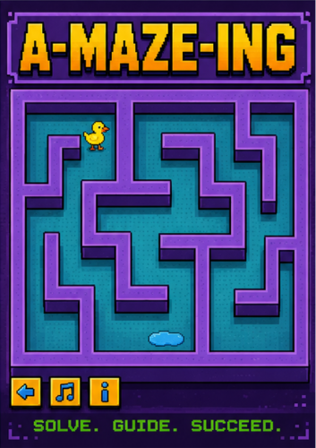
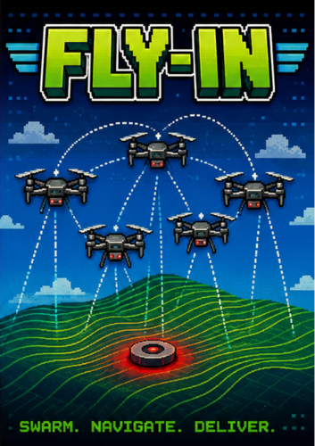
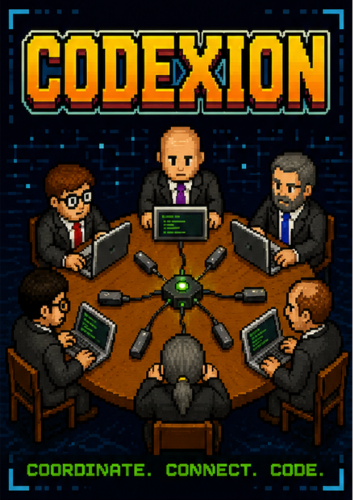
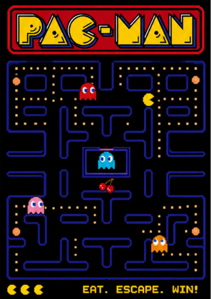

<table width="100%">
  <tr>
    <td >
      
    </td>
    <td>
      <strong>⚡ Web & Game Designer | 3D Artist | Software Developer</strong> 
       
      Creative Technologist bridging the gap between low-level system efficiency and high-fidelity interactive design. Combining robust C/Python software engineering skills from 42 Urduliz with a rich background in 3D art, web design, and game development.
    </td>
  </tr>
</table>

### 💼 Experience & Professional Journey
---

#### 🌐 Web Designer & Developer (Freelance)
*February 2017 - Present*
*   Building custom websites (HTML/CSS, JS, PHP) for international clients via Upwork.
*   Theme configuration and custom deployment on CMS platforms (WordPress, OpenCart, MODX).

#### 🎮 3D & Game Design Specialist
*May 2021 - Present*
*   Creating 3D models and environments utilizing Unreal Engine 5, ZBrush, and Blender for interactive systems and real-time visualization.

#### 🎓 42 Cursus
*January 2026 - Present*
*   A software engineering student at 42 Urduliz Bizkaia (Fundación Telefónica & Diputación Foral de Bizkaia, Spain).
*   I specialize in low-level programming, systems administration, object-oriented design, and algorithms.

---
### 📊 42 Stats & Curriculum
* 🏫 **Campus:** 42 Urduliz Bizkaia (Spain) 🇪🇸
* 📈 **Common Core Completion:** 36% (Level 4.80 / 21)

Progress: [███████░░░░░░░░░░░░░] 36%

**🚀 Highlights:**
* ✅ **22** validated projects
* ⏱️ **970+ hours** of rigorous coursework
 

<b> 👉 Click to view my 42 Milestones, Network Progress & Projects 👈</b>

 

#### 🛠️ Completed 42 Milestones  ->  **👉[Repository](https://github.com/OleksiiShtohrin/Cadet-at-42Cursus-Urduliz)👈**

| Project | Language | Focus / Highlights |
| :--- | :---: | :--- |
| **[Libft](https://github.com/OleksiiShtohrin/Cadet-at-42Cursus-Urduliz/tree/main/Libft)** | `C` | Recreated C standard library functions for solid memory manipulation foundations. |
| **[ft_printf](https://github.com/OleksiiShtohrin/Cadet-at-42Cursus-Urduliz/tree/main/M.1/ft_printf)** | `C` | Recreated the standard formatting output function using variadic arguments. |
| **[get_next_line](https://github.com/OleksiiShtohrin/Cadet-at-42Cursus-Urduliz/tree/main/M.1/get_next_line)** | `C` | Designed an efficient file descriptor line-reading utility using static buffers. |
| **[push_swap](https://github.com/OleksiiShtohrin/Cadet-at-42Cursus-Urduliz/tree/main/M.1/push_swap)** | `C` | Optimized data sorting algorithm on stacks using limited sorting operations. |
| **[Born2beroot](https://github.com/OleksiiShtohrin/Cadet-at-42Cursus-Urduliz/tree/main/M.2/Born2beroot)** | `Shell` | Configured secure virtualized environments with customized firewall and Sudo setups. |
| **[Python 00-10](https://github.com/OleksiiShtohrin/Cadet-at-42Cursus-Urduliz/tree/main/M.2)** | `Python` | Deep dive into OOP, class architecture, decorators, Pydantic, and functional programming. |
| **[A-Maze-ing](https://github.com/OleksiiShtohrin/Cadet-at-42Cursus-Urduliz/tree/main/M.2/A-Maze-ing)** | `Python` | Developed a procedural maze generator and visualizer complying with custom constraints. |
| **[Fly-in](https://github.com/OleksiiShtohrin/Cadet-at-42Cursus-Urduliz/tree/main/M.3/Fly-in)** | `Python` | Autonomous multi-drone routing simulation featuring graph parsing and concurrent pathfinding. |
| **[Codexion](https://github.com/OleksiiShtohrin/Cadet-at-42Cursus-Urduliz/tree/main/M.3/Codexion)** | `C` | Multi-threaded race simulation implementing POSIX threads, mutexes, and EDF scheduling. |
| **[Call Me Maybe](https://github.com/OleksiiShtohrin/Cadet-at-42Cursus-Urduliz/tree/main/M.3/Call-Me-Maybe)** | `Python` | LLM-based function calling system using constrained decoding to translate natural language into structured JSON outputs. |
| **[Pac-Man](https://github.com/aurelienog/pacman)** | `Python` | Recreated the classic Pac-Man arcade game with a modern modular architecture and clean project structure. |
| **[NetPractice](https://github.com/OleksiiShtohrin/Cadet-at-42Cursus-Urduliz/tree/main/M.4/NetPractice)** | `Network` | Solved complex networking routing cases, subnetting, TCP/IP addressing, and gateway configurations. |
| **[RAG against the machine](https://github.com/OleksiiShtohrin/Cadet-at-42Cursus-Urduliz/tree/main/M.4/RAG_AgainstTheMachine)** | `In Progress` | Building a Retrieval-Augmented Generation (RAG) system incorporating vector databases and LLM pipelines. |

#### 🏆 Exams & Ranks Validated
*   **Exam Rank 02** (Validated: March 17, 2026)
*   **Exam Rank 03** (Validated: May 13, 2026)
*   **Exam Rank 04** (Validated: July 30, 2026)

---

### 🛠️ Tech Stack & Creative Toolkit

<table width="100%">
  <tr>
    <th width="16%">⚙️ Languages</th>
    <th width="16%">🔌 Backend</th>
    <th width="16%">🖥️ Frontend</th>
    <th width="16%">🎨 Creative</th>
    <th width="16%">📦 3D Toolkit</th>
    <th width="16%">🛠️ Tools</th>
  </tr>
  <tr>
    <td align="center" valign="top">
       
      
    </td>
    <td align="center" valign="top">
      
    </td>
    <td align="center" valign="top">
       
       
      
    </td>
    <td align="center" valign="top">
       
      
    </td>
    <td align="center" valign="top">
       
       
      
    </td>
    <td align="center" valign="top">
       
       
      
    </td>
  </tr>
</table>

---
### 📣 Languages:
* Ukrainian / Russian (Native)
* Spanish / English (Fluent) 
---

<table width="100%">
  <tr>
    <td align="center">
      
    </td>
    <td align="center">
      
    </td>
    <td align="center">
      
    </td>
    <td align="center">
      
    </td>
  </tr>
</table>
